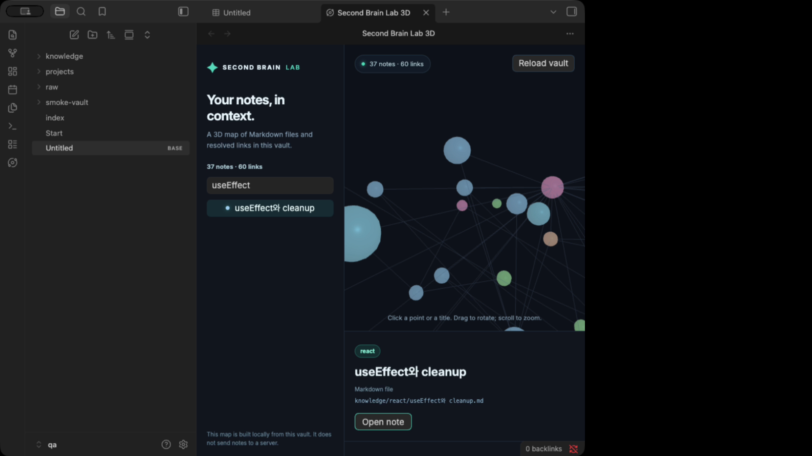
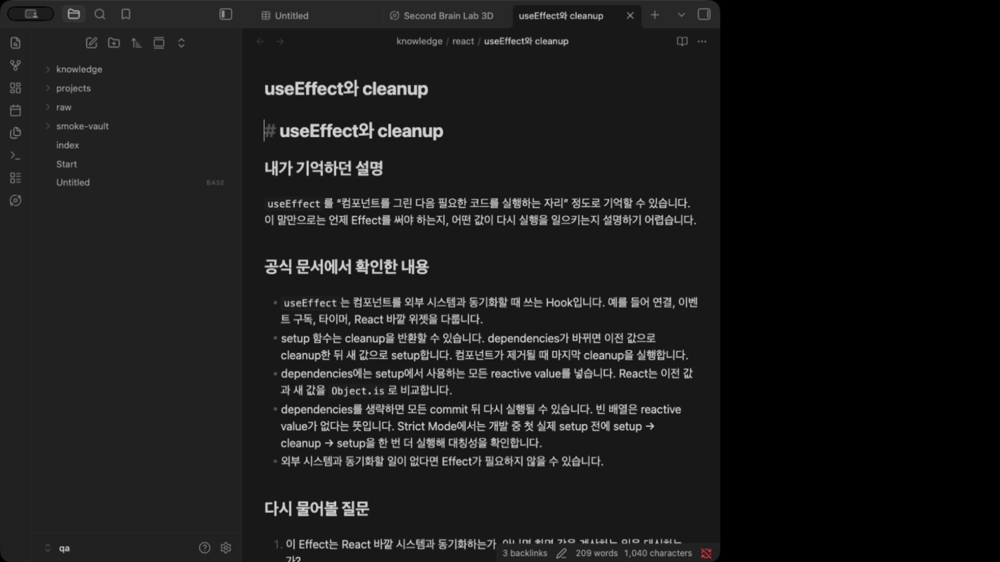

# Second Brain Lab 3D

**English** · [한국어](README.ko.md)

Explore the Markdown notes and resolved internal links in your current Obsidian vault as a 3D map. Click a point or a note title to inspect it, then open the file in Obsidian. The graph maps files and links; it does not represent a human brain or an AI model's reasoning.

This plugin adapts the visual language of the [AI Second Brain Lab practice repo](https://github.com/dante01yoon/ai-second-brain-lab). The practice repo still contains the bilingual sample vault, Codex and Claude Code Hook exercises, and optional local Laya experiment. This plugin is only the read-only 3D vault viewer.

## Screenshots

Captured in desktop Obsidian 1.13.7 with a disposable copy of the public practice vault (37 notes, 60 links). These show the native plugin, not the separate browser viewer.



Select a note in the graph, then **Open note** to read its Markdown file in Obsidian:



[Enabled plugin in Community plugins](docs/screenshots/obsidian-enabled.jpg) · [Interface language and folder settings](docs/screenshots/obsidian-settings.jpg)

## Features

- Interactive Three.js graph with rotate, zoom, search, and a Markdown detail pane
- Uses the **current vault** and Obsidian's resolved internal links; no Node.js server or Vite process
- Opens the selected Markdown file in Obsidian
- Automatically rebuilds after vault or link changes; manual reload is also available
- English and Korean interface, optional folder filter, and configurable note limit (50–5,000)
- Desktop Obsidian 1.13.7 or newer in the first release

## Install

**Status on September 23, 2026:** The [community listing](https://community.obsidian.md/plugins/second-brain-lab) is live, but its automated review is still in progress and **Add to Obsidian** is disabled. After acceptance, open **Settings → Community plugins → Browse**, search for **Second Brain Lab 3D**, then install and enable it. To use the plugin now:

1. Open the vault you want to visualize in desktop Obsidian **1.13.7 or newer**.
2. Download **main.js**, **manifest.json**, and **styles.css** individually from the [0.1.0 release assets](https://github.com/dante01yoon/second-brain-lab-3d/releases/tag/0.1.0). The source-code archive is not the install bundle.
3. Open **Settings → Community plugins** and click the folder icon beside **Installed plugins** to open this vault's `.obsidian/plugins` folder. Create a subfolder named `second-brain-lab`.
4. Put the three downloaded files directly in `<vault>/.obsidian/plugins/second-brain-lab/`. Restart Obsidian, then enable **Second Brain Lab 3D** under **Installed plugins**. If it is missing, check the exact folder and filenames, Restricted mode, and your Obsidian version.

Use the ribbon icon or **Second Brain Lab 3D: Open 3D view** in the command palette (`Cmd/Ctrl+P`). Search for a note title on the left and select a result to read it; click **Open note** to open the actual Markdown file. Choose **Settings → Second Brain Lab 3D → Interface language → Korean** for the Korean interface. You can also change the folder filter and note limit there. The folder path is relative to the vault root. The first 1,000 notes are shown by default; the view reports how many are omitted by the limit.

## Privacy and scope

The plugin reads Markdown files through Obsidian's Vault API and links through its metadata cache. It does not edit files, save AI conversations, run Hooks or Laya, make network requests, or send vault content to any server. It does not require an account or payment and collects no telemetry. Opening a link already present inside a rendered note follows Obsidian's normal behavior.

Node positions are arranged to make folder groups easier to scan. Spatial distance has no semantic or scientific meaning. For very large vaults, narrow the folder filter or lower the note limit to keep the view responsive. Mobile has not been validated and is not included in the first release. The 3D renderer uses [Three.js](https://threejs.org/) under its MIT license; its copyright and license notice is included in the release bundle.

## Develop and verify

Requires Node.js 22+ and npm.

```bash
npm ci
npm run check
```

To try the plugin in a disposable vault, copy `main.js`, `manifest.json`, and `styles.css` into that vault's `.obsidian/plugins/second-brain-lab/` folder and enable it. The GitHub release assets must use a tag exactly matching `manifest.json`'s version. Source code is MIT licensed.
